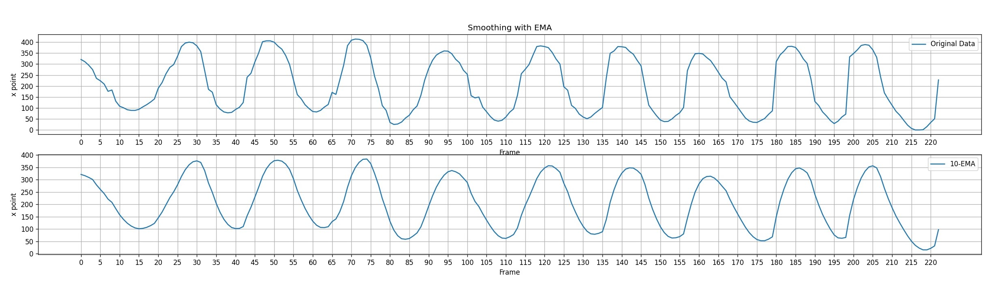
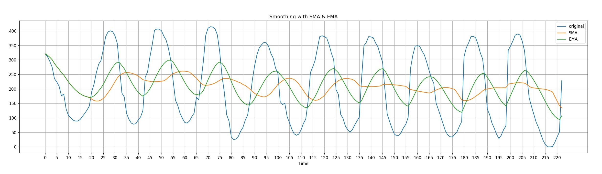

# Moving Average Algorithm
Moving average, also known as `rolling mean` is an algorithm that commonly used with time series data to smooth random short-term variations and to highlight other components (trend, season, or cycle). It will calculated by averaging data of the time series within $\ k$ periods of time resulting the new smoothed data. There are several type of moving average including `Simple Moving Average` and `Exponential Moving Average`. Next I will write a hand tracking program and record the movement data. I write the program in python since I will use the hand tracking library provided by `CVZONE` which is available in python. I will use SMA and EMA algorithm to smoothing the hand movement captured by my camera in real time and do the comparation with the original data that have not been smoothed yet.

## Simple Moving Average (SMA)
The simple moving average is the `unweighted mean` of the previous $\ k$ data points. $\ k$ as the sliding window is modify able. Increasing the $\ k$ value will improve the data smoothness but the data will become less accurate.

<br>

As an example I try to implement SMA smoothing into my hand X coordinate data. The table below show the original data and the data after I implement smoothing into it with the window size of 5 and minimum number periods of 1:

<br>

My SMA code :
```python
import statistics

tempState = [] # will keep the most 5 recent data
tempAvg = 0

def Simple_MovingAverage(point):
    if(len(tempState) < 5):
        tempState.append(point)
    else:
        tempState.append(point)
        tempState.pop(0) # remove old data
                
    if (len(tempState) > 0):
        tempAvg = (statistics.mean(tempState))
        
    return tempAvg
```

Below is the code that I used to record data of hand's X point :

```python
import cv2
import cvzone
from cvzone.HandTrackingModule import HandDetector
 
realData = []
smoothData = []

cap = cv2.VideoCapture(0)
detector = HandDetector(detectionCon=0.8, maxHands=2)
cap.set(cv2.CAP_PROP_FPS,60)
fpsReader = cvzone.FPS()
 
while True:
    success, img = cap.read()
    hands, img = detector.findHands(img)
    _, img = fpsReader.update(img)
 
    if hands:
        # Hand 1
        hand1 = hands[0]points
        centerPoint1 = hand1["center"]  # center of the hand cx,cy
        
        lm = centerPoint1[0] # get x point of hand center 
        realData.append(lm) # add the original data into realData
        smoothData.append(Simple_MovingAverage(lm)) # put the smoothed data into smoothData
 
    cv2.imshow("Image", img)
    if cv2.waitKey(1) & 0xFF == ord('q'): # break loop on key q pressed
        break
        
cap.release()
cv2.destroyAllWindows()
```

After implement smoothing, I plot the result into line graph. Below are the graphic of hand's x point from the original data (before smoothing) and the graph after I implement smoothing into it.

<details><summary>show the code</summary>
<p>

```python
import matplotlib.pyplot as plt
import numpy as np

figure, axis = plt.subplots(2, 1, figsize=(25, 6), dpi=120)

axis[0].plot(np.arange(0, 223, 1),realData, label = "Original Data")
axis[0].legend()
axis[0].set_title('Smoothing with SMA')
axis[0].grid(axis = 'y')
axis[0].grid(axis = 'x')

axis[1].plot(np.arange(0, 223, 1),smoothData, label = "5-SMA")
axis[1].legend()
axis[1].grid(axis = 'y')
axis[1].grid(axis = 'x')
plt.setp(axis, xticks=np.arange(0, 223, 5), yticks=np.arange(0, max(realData), 50), xlabel="Frame", ylabel="x point")
plt.show()
```
</p></details> <br>

<br>

I also put the line into one graph :
<details><summary>show the code</summary>
<p>

```python
import matplotlib.pyplot as plt
import numpy as np

plt.figure(figsize=(25, 6), dpi=120)
plt.plot(np.arange(0, 223, 1),realData, label = "original")
plt.plot(np.arange(0, 223, 1),smoothData, label = "smooth")
plt.legend()
plt.xticks(np.arange(0, 223, 5))
plt.yticks(np.arange(0, max(realData), 50.0))
plt.grid(axis = 'x')
plt.grid(axis = 'y')
plt.title('Smoothing with SMA')
plt.xlabel('Time')
plt.show()
```
</p></details> <br>


<br><br>

## Exponential Moving Average (EMA)
The exponential moving average is the `weighted mean`. The weight of each element will decrease progressively over time but it will never reaching zero. Below is the formula to calculate exponential moving average at the time period $\ t$ :

<br>

with :
* $\ EMA_t$ is the exponential moving average at time period $\ t$
* $\ x_t$ is observation at time period $\ t$
* $\ α = \frac{2}{N + 1}$, with $\ N$ equal to days in $\ EMA$. $\ α$ represent the degree of weighting decrease

As an example I use the same hand tracking data and process it with EMA. I will use window size of 10 EMA so for the first 10 frames I use SMA data and make it as the input for $\ EMA_{t-1}$ on frame 11. Below is my code for EMA :

```python
def Exponential_MovingAverage(point, N, lastEma):
    if(N<5):
        curEma = Simple_MovingAverage(point)
    else:
        alpha = 2/(5 + 1)
        curEma = (point * alpha) + (lastEma * (1-alpha))
    return curEma
```

I use the following code to process the last data :

```python
smoothEmaData = []
lastEma = 0
N = 1
for data in realData:
    temp = Exponential_MovingAverage(data, N, lastEma)
    lastEma = temp
    if(N<5):
        N += 1
    smoothEData.append(temp)
```

You also can call `Exponential_MovingAverage()` for real time smoothing by use the code that I write below :

<details><summary>show the code</summary>
<p>

```python
import cv2
import cvzone
from cvzone.HandTrackingModule import HandDetector
 
realData = []
smoothData = []

cap = cv2.VideoCapture(0)
detector = HandDetector(detectionCon=0.8, maxHands=2)
cap.set(cv2.CAP_PROP_FPS,60)
fpsReader = cvzone.FPS()

smoothEmaData = []
lastEma = 0 # save the EMA(t-1) value
N = 1 
 
while True:
    success, img = cap.read()
    hands, img = detector.findHands(img)
    _, img = fpsReader.update(img)
 
    if hands:
        # Hand 1
        hand1 = hands[0]points
        centerPoint1 = hand1["center"]  # center of the hand cx,cy
        
        lm = centerPoint1[0] # get x point of hand center 
        realData.append(lm) # add the original data into realData
        temp = Exponential_MovingAverage(lm, N, lastEma)
        lastEma = temp
        if(N<10): # set window size into max 10
            N += 1
        smoothEData.append(temp)
 
    cv2.imshow("Image", img)
    if cv2.waitKey(1) & 0xFF == ord('q'): # break loop on key q pressed
        break
        
cap.release()
cv2.destroyAllWindows()
```
</p></details> <br>

Below is the result from EMA data :

<details><summary>show the code</summary>
<p>

```python
import matplotlib.pyplot as plt
import numpy as np

figure, axis = plt.subplots(2, 1, figsize=(25, 6), dpi=120)

axis[0].plot(np.arange(0, 223, 1),realData, label = "Original Data")
axis[0].legend()
axis[0].set_title('Smoothing with EMA')
axis[0].grid(axis = 'y')
axis[0].grid(axis = 'x')

axis[1].plot(np.arange(0, 223, 1),smoothEmaData, label = "10-EMA")
axis[1].legend()
axis[1].grid(axis = 'y')
axis[1].grid(axis = 'x')
plt.setp(axis, xticks=np.arange(0, 223, 5), yticks=np.arange(0, max(realData), 50), xlabel="Frame", ylabel="x point")
plt.savefig('HandTracking_justEma.jpg')
plt.show()
```
</p></details> <br>

<br>

<details><summary>show the code</summary>
<p>

```python
import matplotlib.pyplot as plt
import numpy as np

plt.figure(figsize=(25, 6), dpi=120)
plt.plot(np.arange(0, 223, 1),realData, label = "original")
plt.plot(np.arange(0, 223, 1),smoothEmaData, label = "smooth")
plt.legend()
plt.xticks(np.arange(0, 223, 5))
plt.yticks(np.arange(0, max(realData), 50.0))
plt.grid(axis = 'x')
plt.grid(axis = 'y')
plt.title('Smoothing with EMA')
plt.xlabel('Time')
plt.savefig('HandTracking_JustEma1.jpg')
plt.show()
```
</p></details> <br>

<br>

As you can see the result is simillar with SMA smoothing, you will hardly recognize the difference because we plot them in different graphic.

## SMA and EMA Comparation

I plot EMA and SMA smoothing result together with both window size of 10, below is the graph :

<br>

I also try to increase the window size into 20, below is the result :

<br>

As we can observed there are some differences between simple moving averages and exponential moving averages. EMA place a higher weighting on recent data than on older data, it makes EMA more responsive to the latest changes than SMA. On the other hand, SMA keep represent a true average of data for the entire time period.

# Reference
https://towardsdatascience.com/moving-averages-in-python-16170e20f6c

https://en.wikipedia.org/wiki/Moving_average

https://school.stockcharts.com/doku.php?id=technical_indicators:moving_averages)

https://www.investopedia.com/terms/e/ema.asp