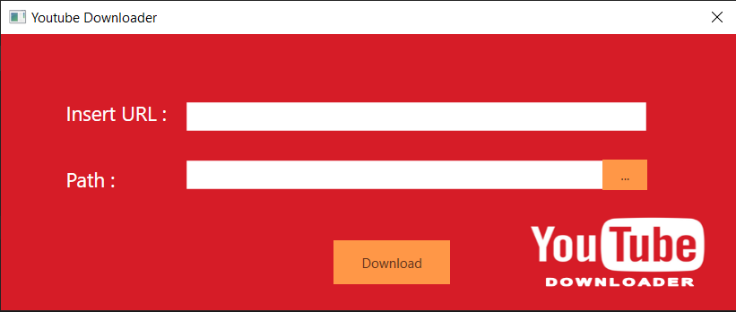
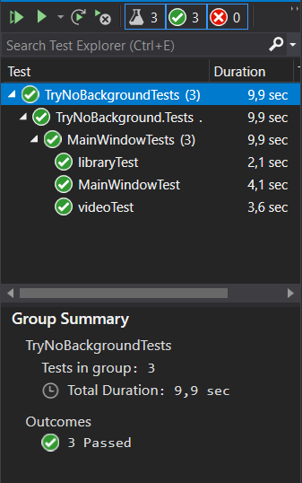
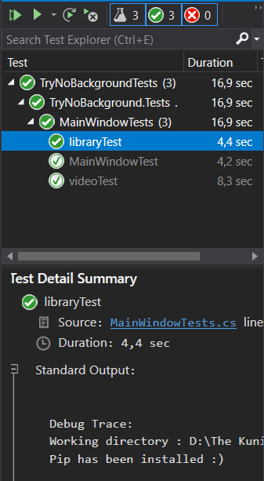
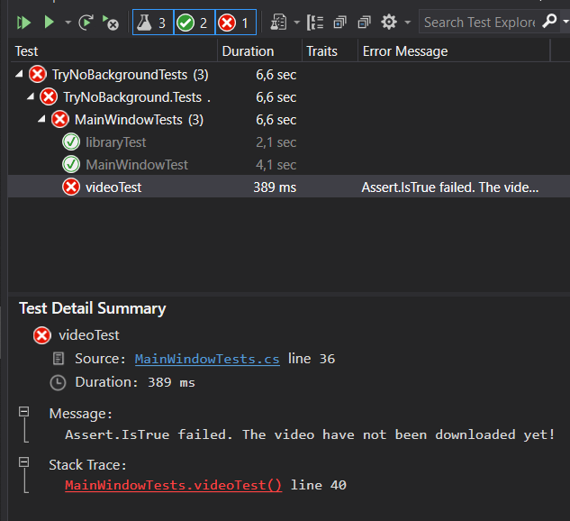

# YouTube下載
> Topic : YouTube Downloader Desktop Application <br>
> Project link : https://github.com/NubletZ/PyTubeC- <br>
> Team member :
> * 資工三 110810505 傅于軒
> * 資工三 110810538 魏美亞 
> 
> Some part of the code that are not originally written by us, including modules and library are referenced below

## About YouTube下載
YouTube下載 is a desktop app that can help user to download video from YouTube.

 <br>



> YouTube下載 UI

This application is developed by using WPF, a UI framework that creates desktop client applications based on C#. To enable our app to download video from YouTube, we use PyTube module from python. In order to use python module in C# we use `Python.Included` library for embedding python into our program.

## Team Job Descriptions
There are several part that need to be done in developing this app, we distribute the jobs explained below :
* 魏美亞 (Wimaya)
    * Setup Environment
        1. Create test environment
        2. Install libraries
        3. Embedding python into C#
        4. Test the python environment
    * Design UI
    * Manage Github main branch
        1. Accepting pull request
        2. Testing each pull request
* 傅于軒 (Christina)
    * Install and import modules
        1. Install and import python modules
        2. Test if module has been imported into C#
    * Working on app function
        1. Write download video function on button click
        2. Test download video function
        3. Write function to let user choose where to save the video
        4. Test open folder function
    * Do the test unit

## Workflow
We use GitHub to develop this application together. Below is our github workflow and commits that we have make :


As for the commits detail can be seen [here](https://github.com/NubletZ/PyTubeC-/commits/main).

## Test Environment
To test our program we use test environment provided by Microsoft Visual Studio. But the default tools can not be use for testing the UI, so we currently use our testing code to feed our program with specific input and check the result.

Below is the full code for testing our app :

```C#
using Microsoft.VisualStudio.TestTools.UnitTesting;
using System;
using System.IO;

namespace TryNoBackground.Tests
{
    [TestClass()]
    public class MainWindowTests
    {
        [TestMethod()]
        public void MainWindowTest()
        {
            MainWindow.startPy();
            bool resInit = MainWindow.pyInit;
            Assert.IsTrue(resInit);
            using (var sw = new StringWriter())
            {
                Console.SetOut(sw);
                MainWindow.pyVersion();

                var resVer = sw.ToString().Trim();
                StringAssert.Contains(resVer, "3.7.3");
            }
        }

        [TestMethod()]
        public void libraryTest()
        {
            MainWindow.startPy();
            Assert.IsNotNull(MainWindow.pytube);
        }

        [TestMethod()]
        public void videoTest()
        {
            MainWindow.startPy();
            string filepath = $"{MainWindow.recordpath}/周杰倫 Jay Chou【稻香 Rice Field】-Official Music Video.mp4";
            Assert.IsTrue(File.Exists(filepath), "The video have not been downloaded yet!");
        }
    }
}
```

From the above code TestClass is the test group which have three unit testing `MainWindowTest`, `libraryTest`, and `videoTest` that could be run independently.

### MainWindowTest Unit
In this unit we make sure that `python 3.7.3` has been embedded correctly in our program 

```C#
[TestMethod()]
public void MainWindowTest()
{
    MainWindow.startPy();
    bool resInit = MainWindow.pyInit;
    Assert.IsTrue(resInit);
    using (var sw = new StringWriter())
    {
        Console.SetOut(sw);
        MainWindow.pyVersion();

        var resVer = sw.ToString().Trim();
        StringAssert.Contains(resVer, "3.7.3");
    }
}
```
in function `MainWindow.startPy()` our program will start the python environment. To check whether python has been initialized or not it will check the value stored in `MainWindow.pyInit` which is a bool that state whether python has been initialized or not. Next in `MainWindow.pyVersion()` it will print out the python version into console, our test program will catch those output and check whether it prints out `3.7.3`.

### libraryTest Unit
In this unit we test our program whether it has import pytube module. In our app we import pytube using this line of code :

```C#
dynamic pytube = PythonEngine.ImportModule("pytube");
```

if PythonEngine can not find pytube, it will return null hence we use `Assert.IsNotNull` to test its value. But we still think of a way to test whether the variable realy contain the data of module that we want.

```C#
[TestMethod()]
public void libraryTest()
{
    MainWindow.startPy();
    Assert.IsNotNull(MainWindow.pytube);
}
```

### videoTest Unit
In this method we feed the program with URL of youtube that we want to download and save it into specific path :

```C#
public async static void startPy()
{
    ...

    pytube = PythonEngine.ImportModule("pytube");
    recordpath = Directory.GetCurrentDirectory();
    string tmp = "https://www.youtube.com/watch?v=sHD_z90ZKV0";
    pytube.__main__.YouTube(tmp).streams.get_highest_resolution().download(recordpath);
}
```

And in test environment we check whether the video that we have downloaded is exist in our directory.

```C#
[TestMethod()]
public void videoTest()
{
    MainWindow.startPy();
    string filepath = $"{MainWindow.recordpath}/周杰倫 Jay Chou【稻香 Rice Field】-Official Music Video.mp4";
    Assert.IsTrue(File.Exists(filepath), "The video have not been downloaded yet!");
}
```

To run the test group and test unit, Microsoft Visual Studio has provide GUI that make test can be done easily, below is our test record :



> record of group test

<br>



> record of unit test of libraryTest, as you can see the other 2 units is written in gray and  have a white passed symbol that means it has been run successfuly previously.

<br>



> record of videoTest before we write the download function, it show error message "Assert.IsTrue failed. The video have not been downloaded yet!"

## Problems That We Face 
1. Using test tools in Microsoft Visual Studio was pretty convenient for us. We can see the execution time, summary, and error messages clearly. We also can easily choose which unit or group to be tested. But because the default tool is not conected to UI, so we still need to find a way on how to test our application via UI instead of only feed in the value into variable from code behind. We will try to approach this problem by using [UI Automation](https://docs.microsoft.com/en-us/dotnet/framework/ui-automation/ui-automation-overview?redirectedfrom=MSDN) which enable test script to interact with the UI.

2. In Visual Studio there are so many auto generated code and log that written in separate file from our code. Everytime we run the program, it will change the log file, another problem is because we use different Visual Studio language version, so it also change every generated code language from Chinese to English and vice versa. Everytime we push our commit into github we can not review the code because there are a lot of unimportant change shown there. To approach this problem, thanks to our teacher and friend's advice to try using Visual Studio with the same language version. Another approach is because this application can run with only files in [Debug](https://github.com/NubletZ/PyTubeC-/tree/main/PytubeNet/TryNoBackground/bin/Debug/netcoreapp3.1) folder so we will also try to put our main code and Debug folder into separate folder which later only this folder will be pushed into Github. This way other file such as log and auto generated code would not be pushed, and it will reduce unimportant changes that shown in our commit.

## What We Got From This Course Project
1. From this course we learnt a lot about how to manage the repository if we become a host, including accept the pull request, test the pull request localy before merge it, solve the merge conflict, etc. After doing this project we become more familliar on some git command and have a better understanding on how to use it.
2. We also learnt so much the important of building test environment for our project. Actualy this is our second application that we built together in Github, but the difference is we did not apply test into our first project. By applying test environment it make us used to write code in order, function by function is tested and make our commit become more clear. With a clear workflow progress it also enable us to see clearly on which function need to do next. 

## Reference
Python.Included - https://github.com/henon/Python.Included

pytube - https://github.com/pytube/pytube

UI Automation - https://docs.microsoft.com/en-us/dotnet/framework/ui-automation/ui-automation-overview?redirectedfrom=MSDN