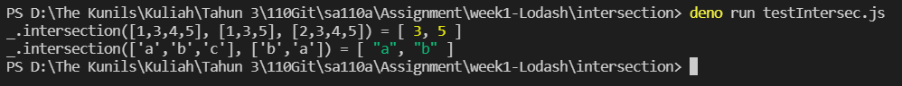

# Practice - Imitate Lodash Intersection Function (傳統方式)
I try to write intersection function using recursion, you can see the code [here](https://github.com/NubletZ/sa110a/blob/master/Assignment/week1-Lodash/intersection/lodashIntersec.js). 
The test result is shown below.

 