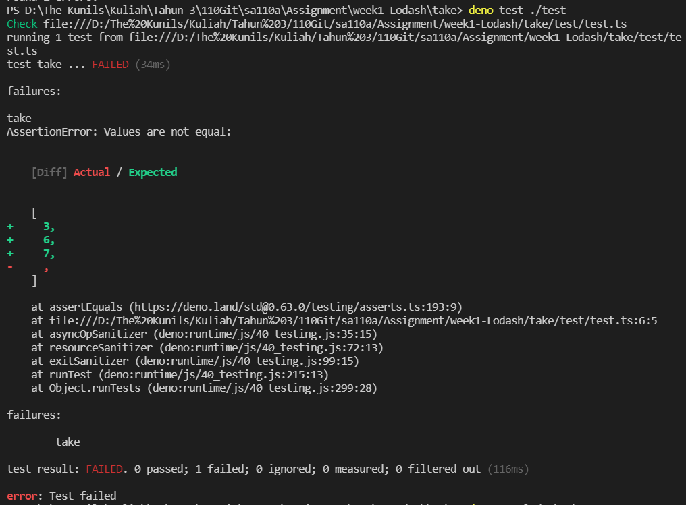
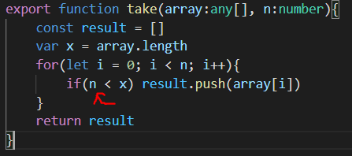
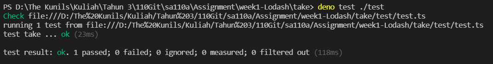

# Practice - Imitate Lodash Take Function (用 TDD 方式)

I try to write Lodash take function and test it using TDD (Test Driven Development) method. At the first try, the test result is `failed`. It show that the test result expect values `3, 6, 7` while my program doesn't return any value.

<br>

after I check my program I found that I write if condition incorrectly

<br>

the second test is :

```
assertEquals(_.take([3,6,7], 6), [3,6,7])
```

so based on my program, the variable value will be `array = [3,6,7]`, `n = 6` and `x = 3`. But because `n > x` so my program will not push any value into result. After I debug my program by changing if condition from `n < x` to `i < x`, I got a correct test result.

<br>