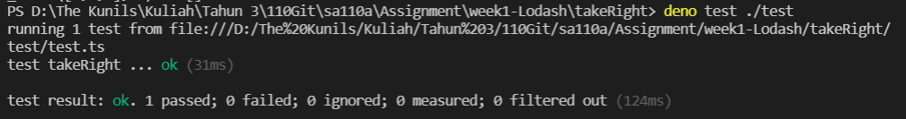

# Practice - Imitate Lodash TakeRight Function (用 BDD 方式)

In this section I try to write Lodash takeRight function using BDD (Behaviour Driven Development) method. I do several test to make sure that my program has work according to how it should behave.

```
import { expect } from 'https://deno.land/x/tdd/mod.ts'
import * as _ from '../takeRight.ts'

Deno.test("takeRight", () => {
    let x = _.takeRight([1,2,3,4], 2)
    expect(x).to.equal([3,4])
    let y = _.takeRight([3,4,6], 6)
    expect(y).to.equal([3,4,6])
    let z = _.takeRight([1,2,3])
    expect(z).to.equal([3])
    let w = _.takeRight([1,2,3], 0)
    expect(w).to.equal([])
})
```

after running the above test, the result shown `passed` which means my program have return the correct value for all conditions.

<br>